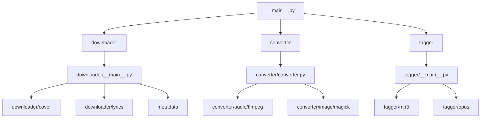

# EALT Codebase Agents / Modules

This document outlines the modular design of EALT. The codebase is organized as a collection of specialized modules (or "agents"), each responsible for a distinct step in the media scraping, conversion, and metadata tagging pipeline.

---

## 1. Downloader Module (`ealt.downloader`)

The **Downloader** is responsible for fetching resources from online providers.

- **Entry Point**: `downloader/__main__.py` containing the `Downloader` class.
- **Sub-components**:
  - `cover/`: Handles downloading album art/thumbnails from YouTube or YouTube Music.
  - `lyrics/`: Handles downloading lyrics by querying providers like `lrclib`, `kugou`, or YouTube.

---

## 2. Converter Module (`ealt.converter`)

The **Converter** handles media processing and format conversion.

- **Entry Point**: `converter/converter.py` containing the `Converter` class.
- **Sub-components**:
  - `audio/ffmpeg.py`: Handles audio conversion (e.g., converting downloads to `.opus` or `.mp3` using `ffmpeg`).
  - `image/magick.py`: Handles cover art conversion and cropping (e.g., cropping image aspect ratio to 1:1 square using ImageMagick `magick`).

---

## 3. Metadata Module (`ealt.metadata`)

The **Metadata** module fetches track/author metadata.

- **Entry Point**: `metadata/__init__.py` exporting metadata helpers.
- **Sub-components**:
  - `youtube.py`: Communicates with the `ytmusicapi` to resolve metadata from YouTube.

---

## 4. Tagger Module (`ealt.tagger`)

The **Tagger** embeds metadata directly into the converted audio files.

- **Entry Point**: `tagger/__main__.py` containing the `Tagger` class.
- **Sub-components**:
  - `mp3.py`: Applies ID3/EasyID3 tags to MP3 files (including description, cover art, and lyrics).
  - `opus.py`: Applies OggOpus metadata blocks/comments to Opus files.
